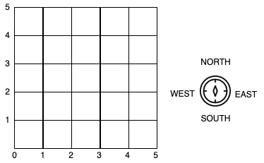

# Toy Robot Simulation

[](https://github.com/rlupat/ToyRobotProject/actions)
[](https://codecov.io/github/rlupat/ToyRobotProject)

## Overview 

The application is a simulation of a toy robot moving on a square table top, of dimensions 5 units x 5 units. 
There are no other obstructions on the table surface. 
The robot is free to roam around the surface of the table, but will be prevented from falling to destruction. 
Any movement that would result in the robot falling from the table will be ignored, 
however further valid movement commands will still be allowed.



### Valid Commands

The console applications can read in commands in the following form:
- `PLACE X,Y,F`
- `MOVE`
- `LEFT`
- `RIGHT`
- `REPORT`

`PLACE` will put the toy robot on the table in position `X,Y` and facing `NORTH`, `SOUTH`, `EAST` or `WEST`.
- The origin (0,0) can be considered to be the SOUTH WEST most corner. 
- It is required that the first command to the robot is a `PLACE` command, after that, 
  any sequence of commands may be issued, in any order, including another `PLACE` command.   
- The application will discard all commands in the sequence until a valid `PLACE` command has been executed.


`MOVE` will move the toy robot one unit forward in the direction it is currently facing.

`LEFT` and `RIGHT` will rotate the robot 90 degrees in the specified direction without changing the position of the robot.

`REPORT` will announce the X,Y and F of the robot to stdout.

### Constraints

- A robot that is not on the table will ignore the `MOVE`, `LEFT`, `RIGHT` and `REPORT` commands.
- Toy robot can not fall off the table during movement. This also includes the initial placement of the toy robot.
Any move that cause the above will be ignored. 

### Example of Valid Commands

```
PLACE 1,2,EAST
MOVE
MOVE
LEFT
MOVE
REPORT
```

## Installation

### Requirements

Python version 3.6 / 3.7 / 3.8 / 3.9. 

### Option 1: From PyPi

- Setup virtual environment
    - `python3 -m venv toyrobot-env`
- Activate virtual environment
    - `source toyrobot-env/bin/activate`
- Install source-code 
    - `pip install rlupat.toyrobot`

### Option 2: From source

- Clone this github repository
- Setup virtual environment
    - `python3 -m venv toyrobot-env`
- Activate virtual environment
    - `source toyrobot-env/bin/activate`
- Install source-code 
    - `pip install <path-to-downloaded-source>`


## Usage

Please ensure virtual environment has been activated 
  `source toyrobot-env/bin/activate`
  
### Option 1: Binary

`toyrobot -i <path-to-input-file>`

Example: `toyrobot -i ./resources/test1.txt`

### Option 2: Python 

`python -m toyrobot.app -i <path-to-input-file>`

Example: `python -m toyrobot.app -i ./resources/test1.txt`

### Extended Usage Info

```shell

usage: toyrobot [-h] -i INPUT [-x SIZEX] [-y SIZEY]

Run Toy models Simulation

optional arguments:
  -h, --help            show this help message and exit
  -i INPUT, --input INPUT
                        file consisting of models movement commands
  -x SIZEX, --sizeX SIZEX
                        dimension of tabletop
  -y SIZEY, --sizeY SIZEY
                        dimension of tabletop

```
  


